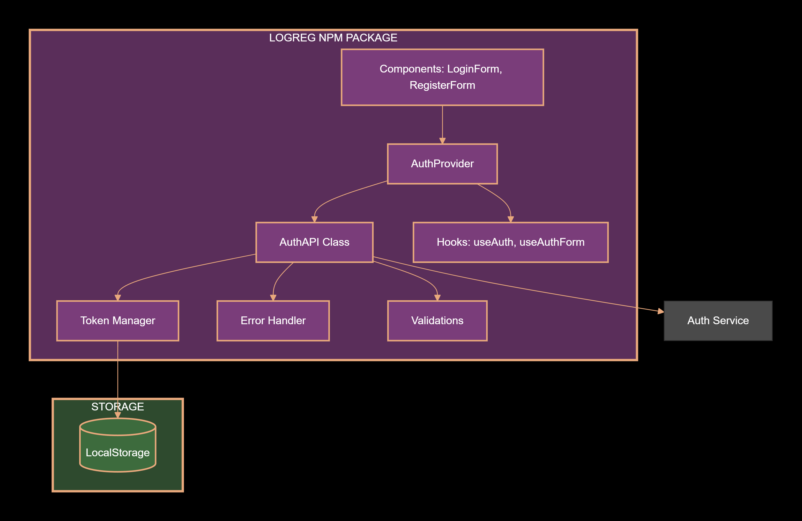
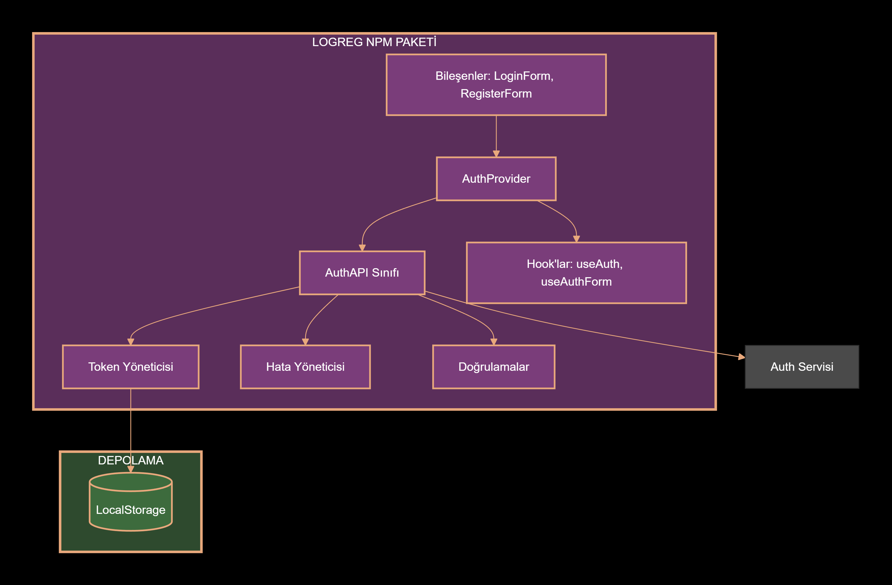

# @bmdinner/logreg

<a id="english"></a>

**English** | [Türkçe](#turkish)

A lightweight authentication client for React applications.

`logreg` provides a small set of tools for login and registration flows: an `AuthProvider` context, form components, and an HTTP client that handles session refresh automatically. It sits between a frontend and a backend that owns the actual authentication logic — the package handles the frontend concerns (form state, validation, session refresh) and leaves credential ownership to the backend.

---

## Flowchart of the project

<p align="center">
  
  <br />
  <em>Data flow of Logreg, how it is implemented to other projects of mine.</em>
</p>
---

## Installation

```bash
npm install @bmdinner/logreg zod
```

`zod` is a peer dependency and is required for form validation.

---

## Quick Start

Wrap your application with `AuthProvider`:

```tsx
import { AuthProvider } from '@bmdinner/logreg';

function App() {
  return (
    <AuthProvider authUrl="/auth">
      {/* your app */}
    </AuthProvider>
  );
}
```

Use `LoginForm` with a Zod schema:

```tsx
import { LoginForm } from '@bmdinner/logreg';
import { z } from 'zod';

const loginSchema = z.object({
  email: z.string().email('Invalid email'),
  password: z.string().min(6, 'Password must be at least 6 characters'),
});

function LoginPage() {
  return (
    <LoginForm
      schema={loginSchema}
      submitButtonText="Sign In"
      onSuccess={() => navigate('/dashboard')}
    />
  );
}
```

Access the current user with `useAuth`:

```tsx
import { useAuth } from '@bmdinner/logreg';

function Profile() {
  const { user, isAuthenticated, logout } = useAuth();
  if (!isAuthenticated) return null;
  return (
    <>
      <p>Signed in as {user.email}</p>
      <button onClick={logout}>Log out</button>
    </>
  );
}
```

---

## API

### `AuthProvider`

Wraps your application and manages authentication state.

| Prop | Type | Default | Description |
|---|---|---|---|
| `authUrl` | `string` | — | Base URL of the auth endpoints. Use `''` for same-origin. |
| `loginEndpoint` | `string` | `/auth/login` | |
| `registerEndpoint` | `string` | `/auth/register` | |
| `logoutEndpoint` | `string` | `/auth/logout` | |
| `refreshEndpoint` | `string` | `/auth/refresh` | |
| `verifyEndpoint` | `string` | `/auth/verify` | Called on mount to hydrate the current user. |
| `forgotPasswordEndpoint` | `string` | `/auth/forgot-password` | |
| `resetPasswordEndpoint` | `string` | `/auth/reset-password` | |
| `onError` | `(error: Error) => void` | — | Optional global error callback. |

### `useAuth`

Returns the authentication context.

```ts
const {
  user,
  loading,
  error,
  isAuthenticated,
  login,
  register,
  logout,
  refreshToken,
  forgotPassword,
  resetPassword,
} = useAuth();
```

### `LoginForm` and `RegisterForm`

Both components accept a Zod schema and render fields from it.

```tsx
<RegisterForm
  schema={registerSchema}
  submitButtonText="Create Account"
  onSuccess={() => navigate('/login')}
  onError={(err) => toast.error(err.message)}
  renderField={(field, state) => <CustomInput {...field} {...state} />}
/>
```

| Prop               | Type | Description |
|--------------------|-------------------------------|-----------------------------------------------------------|
| `schema`           | `z.ZodObject<any>`            | Required. Defines fields and validation rules.            |
| `onSubmit`         | `(data) => Promise<any>`      | Optional override for the default submit handler.         |
| `onSuccess`        | `(result) => void`            | Called after a successful submission.                     |
| `onError`          | `(error) => void`             | Called on failure.                                        |
| `renderField`      | `(field, state) => ReactNode` | Supply your own input component.                          |
| `submitButtonText` | `string`                      |                                                           |
| `className`        | `string`                      |                                                           |

### `AuthAPI`

The underlying HTTP client. Can be used directly for non-React integrations.

```ts
import { AuthAPI } from '@bmdinner/logreg';

const api = new AuthAPI('https://api.example.com', {
  login: '/auth/login',
  register: '/auth/register',
});

const user = await api.verifyToken();
```

---

## Architecture Notes

### Where credentials live

A common pattern is to have the frontend pass API keys or project identifiers to the backend on every request. `logreg` deliberately does the opposite:

- The frontend sends only user credentials (email, password, form data) to the backend.
- The backend attaches its own API key and project identifier before forwarding the request to the auth service.
- The frontend never sees, stores, or transmits these values.

### Where sessions live

`logreg` uses HTTP-only cookies for session storage. Tokens are never written to `localStorage` or `sessionStorage`, and are never exposed to JavaScript.

The `AuthProvider` verifies the session on mount by calling the `verifyEndpoint`. The browser sends the cookie automatically; the backend validates it and returns the current user.

---

## Struggles and Solutions

Notes on problems I ran into while building and integrating this package, and what I did about them.

### Users were logged out after refresh and after closing the tab

**The struggle:** Whenever the page reloaded, or the user closed the tab and came back, they had to log in again. Nothing was carrying the session across page loads, so every refresh started from scratch.

**What I did:** Saved the authenticated user to `localStorage`. On login, the user object goes into `localStorage`. On app mount, the provider reads it back so the UI can render as signed-in immediately, while the session is still being verified against the backend.

I only save the user object, not the session token. The token lives in an HTTP-only cookie that JavaScript can't read. If the cookie is gone or expired, the backend rejects the verification and the user gets logged out — so a stale `localStorage` entry can never grant access on its own. It's a UI hint, not an authentication mechanism.

---

### `apiKey` and `projectId` were leaking from the frontend

**The struggle:** I had `apiKey` and `projectId` being sent from the frontend through the library to the backend, and from there to the auth service. That meant the values were visible in the browser — in the network tab, in DevTools, anywhere someone cared to look. Anyone inspecting the traffic could see them.

**What I did:** Changed the data flow. Instead of the frontend constructing requests that include the API key and project ID, the frontend now sends only the user's credentials to my backend, and the backend attaches those values itself before forwarding to the auth service.

The old flow was:

```
frontend → logreg → backend → auth service
```

The new flow is:

```
frontend → backend → auth service
```

`logreg` handles form fields and session refresh. It no longer knows or cares about `apiKey` or `projectId` — those props were removed entirely. Anything that needs to be attached to a request on behalf of the app now happens on the backend, where the browser can't see it.

**What I learned from this:** If the browser has to know a value, the browser can leak that value. Moving credentials to the backend and keeping the frontend as a thin client is the safer default.

---

### Form fields were hardcoded and couldn't be reused across projects

**The struggle:** The login and register forms had hardcoded field definitions baked in. Every project that used the library needed the same fields. If a project wanted a username field but another didn't, or wanted different password rules, there was no clean way to support that without rewriting the forms per project.

The old approach also split field definitions and validation rules into two separate objects — a `fields` array for the inputs, and a `validationRules` object for the checks. Any time I added or changed a field, I had to update both and hope they stayed in sync.

**What I did:** Moved to Zod schemas. `LoginForm` and `RegisterForm` now take a single `schema` prop. The components read the schema's shape and generate the fields from it — name, label, required flag, everything. Validation is done by calling `schema.safeParse(values)`.

Now different projects can pass different schemas. Whatever fields are in the schema are the fields that render, with whatever rules the schema defines. The two problems I had before — fields being fixed and rules drifting away from fields — both went away, because the schema is the only place either of them is defined.

---

## Backend Contract

`logreg` expects the backend to expose the following endpoints. All responses are JSON.

| Method | Path | Body | Response |
|--------|-------------------------|---------------------------------|-----------------------------------------|
| `POST` | `/auth/login`           | `{ email, password }`           | `{ user }` and `Set-Cookie`             |
| `POST` | `/auth/register`        | `{ username, email, password }` | `{ user }` and `Set-Cookie`             |
| `POST` | `/auth/logout`          | —                               | `{ success: true }` and clears cookies  |
| `POST` | `/auth/refresh`         | —                               | `{ success: true }` and `Set-Cookie`    |
| `GET`  | `/auth/verify`          | —                               | `{ user }`                              |
| `POST` | `/auth/forgot-password` | `{ email }`                     | `{ success: true }`                     |
| `POST` | `/auth/reset-password`  | `{ token, newPassword }`        | `{ success: true }`                     |

The backend is responsible for:

- Attaching its own `apiKey` and `projectId` when forwarding to the auth service.
- Setting cookies with `HttpOnly` and appropriate `SameSite` attributes.
- Returning `Access-Control-Allow-Credentials: true` on cross-origin responses.

The frontend never sends `apiKey` or `projectId`.

---

## License

MIT

---

<a id="turkish"></a>

# @bmdinner/logreg

[English](#english) | **Türkçe**

React uygulamaları için hafif bir kimlik doğrulama istemcisi.

`logreg`, giriş ve kayıt akışları için küçük bir araç seti sunar: bir `AuthProvider` context'i, form bileşenleri ve oturum yenilemeyi otomatik yöneten bir HTTP istemcisi. Frontend ile kimlik doğrulama mantığını barındıran backend arasında konumlanır — paket frontend tarafındaki işleri (form durumu, doğrulama, oturum yenileme) üstlenir ve kimlik bilgilerinin sahipliğini backend'e bırakır.

---

## Projenin Akış Diyagramı

<p align="center">
  
  <br />
  <em>Logreg'in veri akışı ve diğer projelerime nasıl entegre edildiği.</em>
</p>
---

## Kurulum

```bash
npm install @bmdinner/logreg zod
```

`zod` bir peer dependency ve aynı zamanda form doğrulaması için gereklidir.

---

## Kullanım şekilleri

Uygulamanızı `AuthProvider` ile sarmalayın:

```tsx
import { AuthProvider } from '@bmdinner/logreg';

function App() {
  return (
    <AuthProvider authUrl="/auth">
      {/* uygulamanız */}
    </AuthProvider>
  );
}
```

`LoginForm` bileşenini bir Zod şemasıyla kullanın:

```tsx
import { LoginForm } from '@bmdinner/logreg';
import { z } from 'zod';

const loginSchema = z.object({
  email: z.string().email('Geçersiz e-posta'),
  password: z.string().min(6, 'Şifre en az 6 karakter olmalıdır'),
});

function LoginPage() {
  return (
    <LoginForm
      schema={loginSchema}
      submitButtonText="Giriş Yap"
      onSuccess={() => navigate('/dashboard')}
    />
  );
}
```

Aktif kullanıcıya `useAuth` ile erişin:

```tsx
import { useAuth } from '@bmdinner/logreg';

function Profile() {
  const { user, isAuthenticated, logout } = useAuth();
  if (!isAuthenticated) return null;
  return (
    <>
      <p>{user.email} olarak giriş yapıldı</p>
      <button onClick={logout}>Çıkış Yap</button>
    </>
  );
}
```

---

## API

### `AuthProvider`

Uygulamanızı sarmalar ve kimlik doğrulama durumunu yönetir.

| Prop                      | Tip                      | Varsayılan               | Açıklama                                                                                                                     |
|---------------------------|--------------------------|--------------------------|------------------------------------------------------------------------------------------------------------------------------|
| `authUrl`                 | `string`                 |           —              | Auth endpoint'lerinin temel URL'si. Aynı origin için `''` kullanın.                                                          |
| `loginEndpoint`           | `string`                 | `/auth/login`            | Login Endpointi                                                                                                              |
| `registerEndpoint`        | `string`                 | `/auth/register`         | Register Endpointi                                                                                                           |
| `logoutEndpoint`          | `string`                 | `/auth/logout`           | Logout Endpointi                                                                                                             |
| `refreshEndpoint`         | `string`                 | `/auth/refresh`          | Token refresh Endpointi                                                                                                      |
| `verifyEndpoint`          | `string`                 | `/auth/verify`           | Mount sırasında aktif kullanıcıyı yüklemek için çağrılır.                                                                    |
| `forgotPasswordEndpoint`  | `string`                 | `/auth/forgot-password`  | "Şifremi unuttum" Endpointi(Şimdilik bu canlı projelerde çalışmıyor)                                                         |
| `resetPasswordEndpoint`   | `string`                 | `/auth/reset-password`   |  "Şifremi sıfırla" Endpointi(Bu endpointi harekete geçiren statik html sayfaları, CSP ile bloklanıyor, üzerinde çalışıyorum.)|
| `onError`                 | `(error: Error) => void` |           —              | İsteğe bağlı genel hata callback'i.                                                                                          |

### `useAuth`

Kimlik doğrulama context'ini döndürür.

```ts
const {
  user,
  loading,
  error,
  isAuthenticated,
  login,
  register,
  logout,
  refreshToken,
  forgotPassword,
  resetPassword,
} = useAuth();
```

### `LoginForm` ve `RegisterForm`

Her iki bileşen de bir Zod şeması alır ve alanları şemadan üretir.

```tsx
<RegisterForm
  schema={registerSchema}
  submitButtonText="Hesap Oluştur"
  onSuccess={() => navigate('/login')}
  onError={(err) => toast.error(err.message)}
  renderField={(field, state) => <CustomInput {...field} {...state} />}
/>
```

| Prop               | Tip                           | Açıklama                                                        |
|--------------------|-------------------------------|-----------------------------------------------------------------|
| `schema`           | `z.ZodObject<any>`            | Zorunlu. Alanları ve doğrulama kurallarını tanımlar.            |
| `onSubmit`         | `(data) => Promise<any>`      | Varsayılan gönderim işleyicisini değiştirmek için isteğe bağlı. |
| `onSuccess`        | `(result) => void`            | Başarılı gönderimden sonra çağrılır.                            |
| `onError`          | `(error) => void`             | Hata durumunda çağrılır.                                        |
| `renderField`      | `(field, state) => ReactNode` | Kendi input bileşeninizi kullanın.                              |
| `submitButtonText` | `string`                      |                                                                 |
| `className`        | `string`                      |                                                                 |

### `AuthAPI`

Alt katmandaki HTTP istemcisi. React dışı entegrasyonlar için doğrudan kullanılabilir.

```ts
import { AuthAPI } from '@bmdinner/logreg';

const api = new AuthAPI('https://api.example.com', {
  login: '/auth/login',
  register: '/auth/register',
});

const user = await api.verifyToken();
```

---

## Mimari Notları

### Kimlik bilgileri nerede tutulur

Yaygın bir kalıp, frontend'in her istekte backend'e API anahtarı veya proje kimliği göndermesidir. `logreg` bunun tam tersini yapar:

- Frontend, backend'e yalnızca kullanıcı kimlik bilgilerini (e-posta, şifre, form verisi) gönderir.
- Backend, isteği auth servisine iletmeden önce kendi API anahtarını ve proje kimliğini ekler.
- Frontend bu değerleri hiçbir zaman görmez, saklamaz veya iletmez.

### Oturumlar nerede tutulur

`logreg` oturum saklama için HTTP-only cookie'ler kullanır. Token'lar hiçbir zaman `localStorage` veya `sessionStorage`'a yazılmaz ve JavaScript'e açık edilmez.

`AuthProvider`, mount sırasında `verifyEndpoint`'i çağırarak oturumu doğrular. Tarayıcı cookie'yi otomatik gönderir; backend doğrular ve aktif kullanıcıyı döndürür.

---

## Karşılaşılan Sorunlar ve Çözümleri

Bu paketi geliştirirken ve entegre ederken karşılaştığım sorunlar ve bunlara bulduğum çözümler.

### Yenilemeden ve sekme kapatıldıktan sonra kullanıcılar çıkış yapıyordu

**Sorun:** Sayfa her yenilendiğinde veya kullanıcı sekmeyi kapatıp geri döndüğünde tekrar giriş yapmaları gerekiyordu. Sayfa yüklemeleri arasında oturumu taşıyan bir şey yoktu, bu yüzden her yenileme sıfırdan başlıyordu.

**Çözümüm:** Kimliği doğrulanmış kullanıcıyı `localStorage`'a kaydettim. Girişte kullanıcı nesnesi `localStorage`'a yazılır. Uygulama mount olduğunda provider bunu geri okur, böylece arayüz hemen giriş yapılmış olarak görünür — bu sırada oturum backend'e karşı doğrulanmaya devam eder.

Yalnızca kullanıcı nesnesini kaydediyorum, oturum token'ını değil. Token, JavaScript'in okuyamadığı bir HTTP-only cookie'de tutulur. Cookie yoksa veya süresi dolmuşsa backend doğrulamayı reddeder ve kullanıcı çıkış yapmış olur — yani eski bir `localStorage` kaydı tek başına erişim sağlayamaz. Bu bir arayüz ipucudur, kimlik doğrulama mekanizması değildir.

---

### `apiKey` ve `projectId` frontend'den sızıyordu

**Sorun:** `apiKey` ve `projectId` frontend'den kütüphane üzerinden backend'e ve oradan auth servisine gönderiliyordu. Bu, değerlerin tarayıcıda görünür olması anlamına geliyordu — network sekmesinde, DevTools'ta, bakmak isteyen her yerde. Trafiği inceleyen biri bunları görebiliyordu.

**Çözümüm:** Veri akışını değiştirdim. Frontend'in API anahtarını ve proje kimliğini içeren istekleri oluşturması yerine, frontend artık backend'e yalnızca kullanıcının kimlik bilgilerini gönderiyor, backend bu değerleri kendisi ekleyip auth servisine iletiyor.

Eski akış:

```
frontend → logreg → backend → auth service
```

Yeni akış:

```
frontend → backend → auth service
```

`logreg` form alanlarını ve oturum yenilemeyi yönetiyor. Artık `apiKey` veya `projectId`'yi bilmiyor, umursamıyor — bu prop'lar tamamen kaldırıldı. Uygulama adına bir isteğe eklenmesi gereken her şey artık backend'de, tarayıcının göremeyeceği yerde yapılıyor.

**Bundan çıkardığım ders:** Tarayıcının bilmesi gereken bir değer varsa, tarayıcı o değeri sızdırabilir. Kimlik bilgilerini backend'e taşımak ve frontend'i ince bir istemci olarak tutmak daha güvenli varsayılandır.

---

### Form alanları sabit kodluydu ve projeler arasında yeniden kullanılamıyordu

**Sorun:** Giriş ve kayıt formlarının alan tanımları sabit kodluydu. Kütüphaneyi kullanan her projenin aynı alanlara ihtiyacı vardı. Bir proje kullanıcı adı alanı isteyip diğeri istemiyorsa veya farklı şifre kuralları istiyorsa, formları proje başına yeniden yazmadan bunu desteklemenin temiz bir yolu yoktu.

Eski yaklaşım ayrıca alan tanımlarını ve doğrulama kurallarını iki ayrı nesneye bölüyordu — input'lar için bir `fields` dizisi, kontroller için bir `validationRules` nesnesi. Bir alan eklediğimde veya değiştirdiğimde her ikisini de güncellemem ve senkron kalmalarını ummam gerekiyordu.

**Çözümüm:** Zod şemalarına geçtim. `LoginForm` ve `RegisterForm` artık tek bir `schema` prop'u alıyor. Bileşenler şemanın şeklini okuyup alanları ondan üretiyor — isim, etiket, zorunluluk, hepsi. Doğrulama `schema.safeParse(values)` çağrılarak yapılıyor.

Artık farklı projeler farklı şemalar geçebiliyor. Şemada hangi alanlar varsa, o alanlar o kurallarla render ediliyor. Önceki iki sorunum — alanların sabit olması ve kuralların alanlardan kopması — ikisi de ortadan kalktı, çünkü şema her ikisinin de tanımlandığı tek yer.

---

## Backend Sözleşmesi

`logreg` backend'in aşağıdaki endpoint'leri sunmasını bekler. Tüm cevaplar JSON'dur.

| Metot  | Yol                     | Gövde                           | Cevap                                       |
|--------|-------------------------|---------------------------------|---------------------------------------------|
| `POST` | `/auth/login`           | `{ email, password }`           | `{ user }` ve `Set-Cookie`                  |
| `POST` | `/auth/register`        | `{ username, email, password }` | `{ user }` ve `Set-Cookie`                  |
| `POST` | `/auth/logout`          | —                               | `{ success: true }` ve cookie'leri temizler |
| `POST` | `/auth/refresh`         | —                               | `{ success: true }` ve `Set-Cookie`         |
| `GET`  | `/auth/verify`          | —                               | `{ user }`                                  |
| `POST` | `/auth/forgot-password` | `{ email }`                     | `{ success: true }`                         |
| `POST` | `/auth/reset-password`  | `{ token, newPassword }`        | `{ success: true }`                         |

Backend'in sorumlulukları:

- Auth servisine iletirken kendi `apiKey` ve `projectId` değerlerini eklemek.
- Cookie'leri `HttpOnly` ve uygun `SameSite` öznitelikleriyle ayarlamak.
- Cross-origin cevaplarda `Access-Control-Allow-Credentials: true` döndürmek.

Frontend hiçbir zaman `apiKey` veya `projectId` göndermez.

---

## Lisans

MIT
